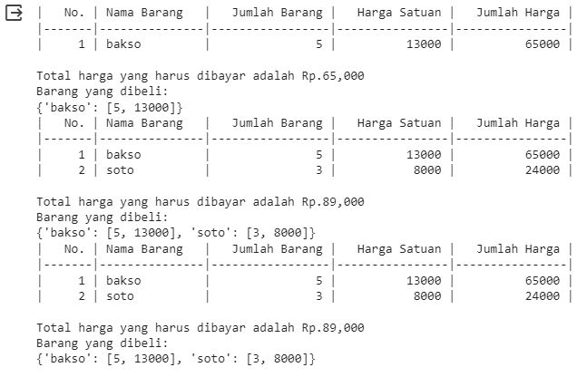
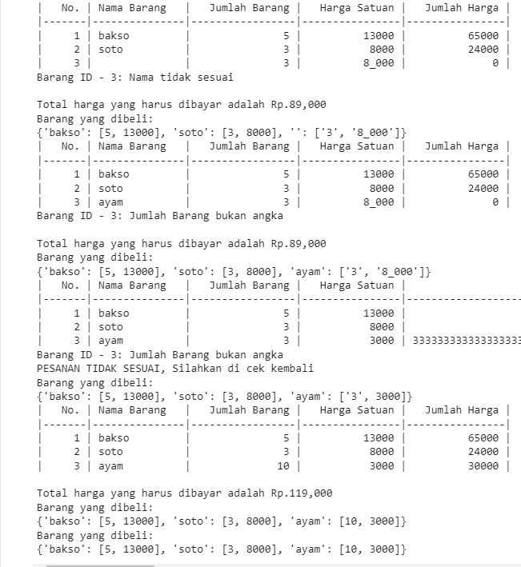
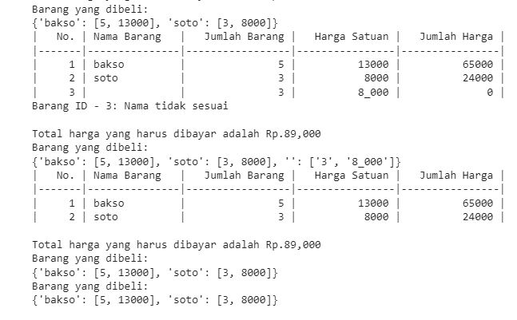
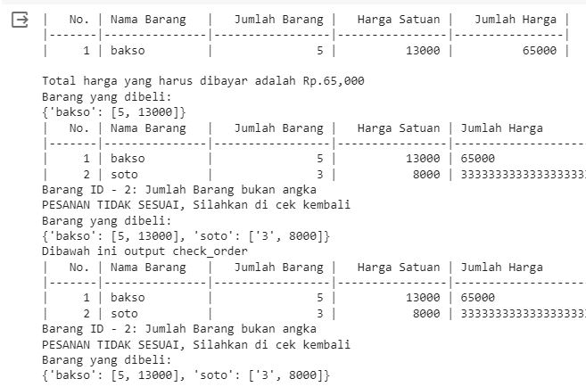
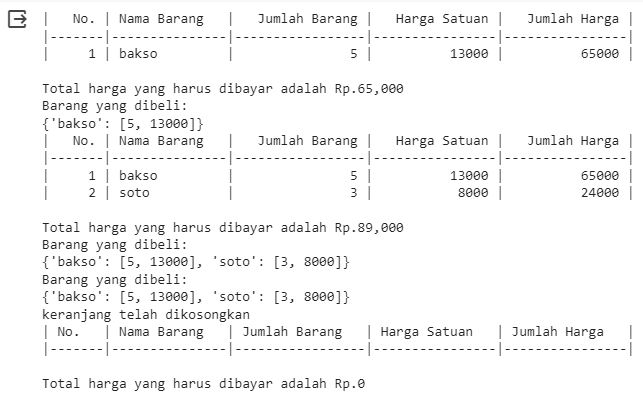
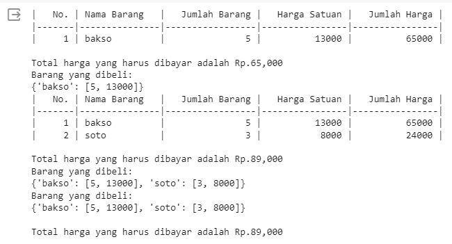
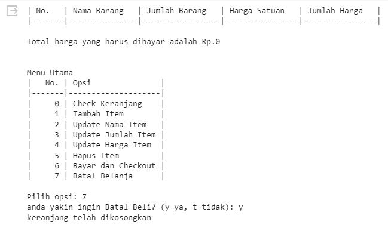

# Dokumentasi
---
## Requirements & Objectives
**Latar Belakang** <br/>
Andi ingin menambahkan sistem self-service di supermarket miliknya agar customer bisa membeli barang sesuai kebutuhan mereka di tempat yang jauh dari supermarket, misalnya saat di kota lain.
<br/><br/>

**Requirement:** <br/>
**1. Tools:**
- Google Colab

**2. Library:**
- tabulate
- os

**3. Method:**
- **add_item([ `<nama_item>`, `<jumlah_item>`, `<harga_per_item>` ])** <br/>

	Method yang digunakan untuk menambahkan item berdasarkan parameter berikut:
  - **`<nama_item>`:** attribute nama barang yang akan dibeli oleh customer
  - **`<jumlah_item>`:** attribute jumlah barang yang akan dibeli oleh customer
  - **`<harga_per_item>`:** attribute harga barang per satuan 
  - Code 
```python
  def add_items(self, data):
    '''
      Menambahkan item ke keranjang

      Parameter :
      -----------
      data : list/dict
        Data item berisikan nama, jumlah dan harga barang

    '''
    if len(self.keranjang) == 0:
      id_barang = len(self.keranjang) + 1
    else:
      for barang in self.keranjang:
        id_barang = barang['id'] + 1

    try:
      self.keranjang.append({
        "id": id_barang,
        "nama" : data[0],
        "jumlah" : data[1],
        "harga" : data[2],
        "total" : data[1]*data[2]
      })

    except:
      self.keranjang.append({
        "id": id_barang,
        "nama" : data[0],
        "jumlah" : data[1],
        "harga" : data[2],
        "total" : 0
      })

    self.check_order()
    self.test_case_output(self.keranjang)
```
- **update_item_name(`<id_item>`, `<update_nama_item>`)** <br/>
	Method yang digunakan untuk mengupdate item berdasarkan parameter berikut:
	- **`<id_item>`:** attribute id barang yang akan diubah oleh customer
	- **`<update_nama_item>`:** attribute nama barang yang baru
	- Code
```python
  def update_item_name(self, id_item, update_nama):
    '''
      Memperbaiki dan mengupdate nama item

      Parameter :
      ----------
      id_item : int
        ID item berdasarkan urutan pemesanan
      update_nama : str
        Nama item baru yang akan diberikan

    '''
    for barang in self.keranjang:
      if barang['id'] == id_item:
        barang.update({
            'id': barang['id'],
            'nama': update_nama,
            'jumlah': barang['jumlah'],
            'harga': barang['harga'],
            'total': barang['total']
          })

    self.check_order()
    self.test_case_output(self.keranjang)
```
- **update_item_qty(`<id_item>`, `<update_jumlah_item>`)**
	- **`<id_item>`**: attribute id barang yang akan diubah oleh customer
	- **`<update_jumlah_item>`**: attribute jumlah barang yang baru
	- Code
```python
  def update_item_qty(self, id_item, update_jumlah):
    '''
      Memperbaiki dan mengupdate jumlah item

      Parameter :
      ----------
      id_item : int
        ID item berdasarkan urutan pemesanan
      update_jumlah : str
        Jumlah item baru yang akan diberikan

    '''
    for barang in self.keranjang:
      if barang['id'] == id_item:
        barang.update({
            'id': barang['id'],
            'nama': barang['nama'],
            'jumlah': update_jumlah,
            'harga': barang['harga'],
            'total': update_jumlah*barang['harga']
          })

    self.check_order()
    self.test_case_output(self.keranjang)
```
- **update_item_price(`<id_item>`, `<update_harga_item>`)**
	- **`<id_item>`:** attribute id barang yang akan diubah oleh customer
	-	**`<update_harga_item>`:** attribute harga barang yang baru
	-	Code
```python
  def update_item_price(self, id_item, update_harga):
    '''
      Memperbaiki dan mengupdate harga item

      Parameter :
      ----------
      id_item : int
        ID item berdasarkan urutan pemesanan
      update_harga : str
        Harga item baru yang akan diberikan

    '''
    for barang in self.keranjang:
      if barang['id'] == id_item:
        barang.update({
            'id': barang['id'],
            'nama': barang['nama'],
            'jumlah': barang['jumlah'],
            'harga': update_harga,
            'total': barang['jumlah']*update_harga
          })

    self.check_order()
    self.test_case_output(self.keranjang)
```
- **delete_item(`<id_item>`)** <br/>
	Method yang digunakan untuk menghapus salah satu atau beberapa item barang dari list keranjang barang yang akan dibeli berdasarkan id barang
  - **`<id_item>`:** attribute id barang yang akan dihapus oleh customer
  - Code
```python
  def delete_item(self, id_item):
    '''
      Menghapus salah satu item dari keranjang

      Parameter :
      ----------
      id_item : int
        ID item yang akan dihapus

    '''
    for index, barang in enumerate(self.keranjang):
      if barang['id'] == id_item:
        self.keranjang.pop(index)

    self.check_order()
    self.test_case_output(self.keranjang)
```
- **reset_transaction()** <br/>
Method yang digunakan untuk menghapus semua barang belanjaan di dalam list keranjang yang tidak akan dibeli
```python
def reset_transaction(self):
    ''' Menghapus seluruh item dari keranjang '''
    self.keranjang = []
    print("keranjang telah dikosongkan")
```
- **check_order()** <br/>
Method yang digunakan untuk mengecek barang yang telah diinputkan kedalam keranjang, apakah sudah sesuai dengan keinginan atau tidak. Ditampilkan dalam bentuk tabel.
```python
def check_order(self):
    '''
      Mengecek item dan kesalahan yang terdapat dalam keranjang

    '''
    header = ["No.", "Nama Barang", "Jumlah Barang", "Harga Satuan", "Jumlah Harga"]
    table = []
    for barang in self.keranjang:
      table.append([
          barang["id"],
          barang["nama"],
          barang["jumlah"],
          barang["harga"],
          barang["total"]
        ])
    print(tabulate(table, headers = header, tablefmt = "github"))

    try:
      for barang in self.keranjang:
        if len(barang["nama"]) == 0:
          raise ValueError(f"Barang ID - {barang['id']}: Nama tidak sesuai")
        if type(barang["jumlah"]) != int:
          raise ValueError(f"Barang ID - {barang['id']}: Jumlah Barang bukan angka")
        if type(barang["harga"]) != int:
          raise ValueError(f"Barang ID - {barang['id']}: Harga bukan angka")

    except ValueError as e:
      print(e)

    self.total_price()
```
- **total_price()** <br/>
Method yang digunakan untuk menampilkan harga total keseluruhan item barang yang dibeli beserta diskonnya. Nilai yang ditampilkan adalah total harga yang telah dikenakan diskon.
```python
def total_price(self):
    '''
    Menampilkan harga keseluruhan item dalam keranjang
    beserta diskon dan harga setelah diskon
    '''
    try:
      total_harga = 0
      for barang in self.keranjang:
        total_harga += barang["total"]
      if total_harga > 500_000:
        total_harga = total_harga - (total_harga * 0.1)
        print("Selamat! Anda mendapatkan diskon sebesar 10%")
      elif total_harga > 300_000:
        total_harga = total_harga - (total_harga * 0.08)
        print("Selamat! Anda mendapatkan diskon sebesar 8%")
      elif total_harga > 200_000:
        total_harga = total_harga - (total_harga * 0.05)
        print("Selamat! Anda mendapatkan diskon sebesar 5%")
      print(f"\nTotal harga yang harus dibayar adalah Rp.{total_harga:,.0f}")

    except TypeError:
      print(TypeError('PESANAN TIDAK SESUAI, Silahkan di cek kembali'))
```
<br/><br/>

**Objektif:** <br/>
Membuat aplikasi python kasir self-service sehingga customer/pelanggan bisa menginput barang sendiri sesuai dengan yang mereka inginkan

## Flowchart
 \
**Alur Flowchart:**
1. Mulai
2. Inisialisasi objek `Transaction()` sebagai `transaksi_1`
3. Output Menu (berisikan Opsi) yang ada di method `menu()`
4. Input Opsi (0-7)
5. Jika Input Opsi == 0 (cek keranjang) maka:
	1) Pada opsi ini akan diarahkan ke method `check_order()`
	2) Kemudian akan tampil tabel keranjang belanja
	3) Selanjutnya akan dicek apakah ada error pada saat `check_order()` tadi
	- Jika ada maka:
		1. Akan muncul output pesan error
		2. Kemudian kembali ke input opsi menu
	- Jika tidak maka:
		1. Akan muncul output "pemesanan sudah benar"
		2. Kemudian akan memproses method `total_price()`
		3. Lalu akan muncul output dari hasil perhitungan `total_price()`
	4) Selanjutnya akan kembali ke `menu()`
6. Jika Input Opsi == 1 (add item) maka:
	1) Input `nama_item` berupa `String`
	2) Input `qty_item` berupa `Int`
	3) Input `harga_item` berupa `Int`
	4) Selanjutnya akan diproses pada method `add_item()`
	5) Kemudian akan diproses apakah ada error saat input pada method `check_order()`
	6) Kemudian akan tampil tabel keranjang belanja
	7) Selanjutnya akan dicek apakah ada error pada saat `check_order()` tadi
	- Jika ada maka:
		1. Akan muncul output pesan error
		2. Kemudian kembali ke input opsi menu
	- Jika tidak maka:
		1. Akan muncul output "pemesanan sudah benar"
		2. Kemudian akan memproses method `total_price()`
		3. Lalu akan muncul output dari hasil perhitungan `total_price()`
	8) Selanjutnya akan kembali ke `menu()`
7. Jika Input Opsi == 2 (update nama item) maka:
	1) Input `id_item` berupa `Int`
	2) Input `nama_baru_item` berupa `String`
	3) Selanjutnya akan diproses pada method `update_item_name()`
	4) Kemudian akan diproses apakah ada error saat input pada method `check_order()`
	5) Kemudian akan tampil tabel keranjang belanja
	6) Selanjutnya akan dicek apakah ada error pada saat `check_order()` tadi
	- Jika ada maka:
		1. Akan muncul output pesan error
		2. Kemudian kembali ke input opsi menu
	- Jika tidak maka:
		1. Akan muncul output "pemesanan sudah benar"
		2. Kemudian akan memproses method `total_price()`
		3. Lalu akan muncul output dari hasil perhitungan `total_price()`
	7) Selanjutnya akan kembali ke `menu()`
8. Jika Input Opsi == 3 (update qty item) maka:
	1) Input `id_item` berupa `Int`
	2) Input `qty_baru_item` berupa `Int`
	4) Selanjutnya akan diproses pada method `update_item_qty()`
	5) Kemudian akan diproses apakah ada error saat input pada method `check_order()`
	6) Kemudian akan tampil tabel keranjang belanja
	7) Selanjutnya akan dicek apakah ada error pada saat `check_order()` tadi
	- Jika ada maka:
		1. Akan muncul output pesan error
		2. Kemudian kembali ke input opsi menu
	- Jika tidak maka:
		1. Akan muncul output "pemesanan sudah benar"
		2. Kemudian akan memproses method `total_price()`
		3. Lalu akan muncul output dari hasil perhitungan `total_price()`
	8) Selanjutnya akan kembali ke `menu()`
9. Jika Input Opsi == 4 (update price item) maka:
	1) Input `id_item` berupa `Int`
	2) Input `harga_baru_item` berupa `Int`
	3) Selanjutnya akan diproses pada method `update_item_harga()`
	4) Kemudian akan diproses apakah ada error saat input pada method `check_order()`
	5) Kemudian akan tampil tabel keranjang belanja
	6) Selanjutnya akan dicek apakah ada error pada saat `check_order()` tadi
	- Jika ada maka:
		1. Akan muncul output pesan error
		2. Kemudian kembali ke input opsi menu
	- Jika tidak maka:
		1. Akan muncul output "pemesanan sudah benar"
		2. Kemudian akan memproses method `total_price()`
		3. Lalu akan muncul output dari hasil perhitungan `total_price()`
	7) Selanjutnya akan kembali ke `menu()`
10. Jika Input Opsi == 5 (delete item) maka:
	1) Input `id_item` berupa `Int`
	2) Selanjutnya akan diproses pada method `delete_item()`
	3) Kemudian akan diproses apakah ada error saat input pada method `check_order()`
	4) Kemudian akan tampil tabel keranjang belanja
	5) Selanjutnya akan dicek apakah ada error pada saat `check_order()` tadi
	- Jika ada maka:
		1. Akan muncul output pesan error
		2. Kemudian kembali ke input opsi menu
	- Jika tidak maka:
		1. Akan muncul output "pemesanan sudah benar"
		2. Kemudian akan memproses method `total_price()`
		3. Lalu akan muncul output dari hasil perhitungan `total_price()`
	6) Selanjutnya akan kembali ke `menu()`
11. Jika Input Opsi == 6 (checkout) maka:
	1) Pada opsi ini akan diarahkan ke method `check_order()`
	2) Kemudian akan tampil tabel keranjang belanja
	3) Selanjutnya akan dicek apakah ada error pada saat `check_order()` tadi
	- Jika ada maka:
		1. Akan muncul output pesan error
		2. Kemudian kembali ke input opsi menu
	- Jika tidak maka:
		1. Akan muncul output "pemesanan sudah benar"
		2. Kemudian akan memproses method `total_price()`
		3. Lalu akan muncul output dari hasil perhitungan `total_price()`
	4) Selanjutnya akan muncul opsi "checkout?"
	-	jika ya maka:
		1. Akan menjalankan method `reset_transaction()`
		2. Kemudian program akan berhenti/selesai
	- Jika tidak:
		1. Kembali ke input opsi menu
12. Jika Input Opsi == 7 (batal belanja) maka:
	1) Akan menjalankan method `reset_transaction()`
	2) Kemudian program akan berhenti/selesai

## Conclusion & Future Works
- Dengan Class serta Method yang sudah dibuat
- Untuk future work, seandainya saya memiliki waktu lebih dan SDM lebih mungkin saya akan mengembangkan modul ini menjadi aplikasi yang memiliki tampilan GUI, terkoneksi dengan Database dan menambahkan class khusus untuk menampilkan multiple error agar user tau error dibagian mana saja (karena saat ini error hanya ditampilkan 1 dan secara urut berdasarkan error pertama)

---
## Demonstrasi

---
### Tambah Barang
- Code
```python
# inisialsisasi instance transaksi
transaksi_1 = Transaction()

# menambah item
transaksi_1.add_items(['bakso', 5, 13_000])
transaksi_1.add_items(['soto', 3, 8_000])

# show keranjang
transaksi_1.check_order()

# membuat output sesuai test case
# {'nama_item': [jumlah, harga]}
transaksi_1.test_case_output(transaksi_1.keranjang)
```
- Output  <br/>

### Update Barang
- Code
```python
# inisialsisasi instance transaksi
transaksi_2 = Transaction()

# menambah item
transaksi_2.add_items(['bakso', 5, 13_000])
transaksi_2.add_items(['soto', 3, 8_000])
transaksi_2.add_items(['', '3', '8_000'])

# update nama item
transaksi_2.update_item_name(id_item=3, update_nama='ayam')

# update harga item
transaksi_2.update_item_price(id_item=3, update_harga=3_000)

# update jumlah item
transaksi_2.update_item_qty(id_item=3, update_jumlah=10)

# membuat output sesuai test case
# {'nama_item': [jumlah, harga]}
transaksi_2.test_case_output(transaksi_2.keranjang)
```
- Output  <br/>

### Delete Barang
- Code
```python
# inisialsisasi instance transaksi
transaksi_3 = Transaction()

# menambah item
transaksi_3.add_items(['bakso', 5, 13_000])
transaksi_3.add_items(['soto', 3, 8_000])
transaksi_3.add_items(['', '3', '8_000'])

# menghapus item
transaksi_3.delete_item(3)

# membuat output sesuai test case
# {'nama_item': [jumlah, harga]}
transaksi_3.test_case_output(transaksi_3.keranjang)
```
- Output  <br/>

### Check Order
- Code (Check tanpa error)
```python
# inisialsisasi instance transaksi
transaksi_4 = Transaction()

# menambah item
transaksi_4.add_items(['bakso', 5, 13_000])
transaksi_4.add_items(['soto', 3, 8_000])

# menghapus item
print("Dibawah ini output check_order")
transaksi_4.check_order()

# membuat output sesuai test case
# {'nama_item': [jumlah, harga]}
transaksi_4.test_case_output(transaksi_4.keranjang)
```
- Output  <br/>

- Code (Check jika error)
```python
# inisialsisasi instance transaksi
transaksi_5 = Transaction()

# menambah item
transaksi_5.add_items(['bakso', 5, 13_000])
transaksi_5.add_items(['soto', '3', 8_000])

# menghapus item
print("Dibawah ini output check_order")
transaksi_5.check_order()

# membuat output sesuai test case
# {'nama_item': [jumlah, harga]}
transaksi_5.test_case_output(transaksi_5.keranjang)
```
- Output  <br/>

### Reset Transaksi
- Code
```python
# inisialsisasi instance transaksi
transaksi_6 = Transaction()

# menambah item
transaksi_6.add_items(['bakso', 5, 13_000])
transaksi_6.add_items(['soto', 3, 8_000])

# membuat output sesuai test case
# {'nama_item': [jumlah, harga]}
transaksi_6.test_case_output(transaksi_6.keranjang)

# reset transaksi
transaksi_6.reset_transaction()

# check order
transaksi_6.check_order()
```
- Output  <br/>

### Total Harga
- Code
```python
# inisialsisasi instance transaksi
transaksi_7 = Transaction()

# menambah item
transaksi_7.add_items(['bakso', 5, 13_000])
transaksi_7.add_items(['soto', 3, 8_000])

# membuat output sesuai test case
# {'nama_item': [jumlah, harga]}
transaksi_7.test_case_output(transaksi_7.keranjang)

# hitung total belanja
transaksi_7.total_price()
```
- Output  <br/>

### Menu Transaksi
- Code
```python
transaksi = Transaction()
transaksi.menu()
```
- Output  <br/>
